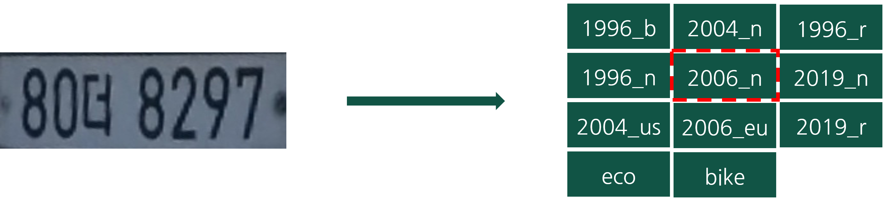

# Car-Plate-De-identification

### Project Goal
- Car Plate De-identification
--------------

### Dependencies
- numpy 1.2+
- opencv-python 4.8+
- pytorch 2.0+
--------------

### Method
#### 1. Plate Detection
We detect car plate using yolov5. 

  

#### 2. 4-Corner Detection
We predict 4 corner of car plate using custom model. 

  

#### 3. Classification
We classify car plate type using custom model. (1996_b, 2004_n, ....) 

  

#### 4. De-Identification
We make natural car plate using De-Identification technique in three steps below. 

